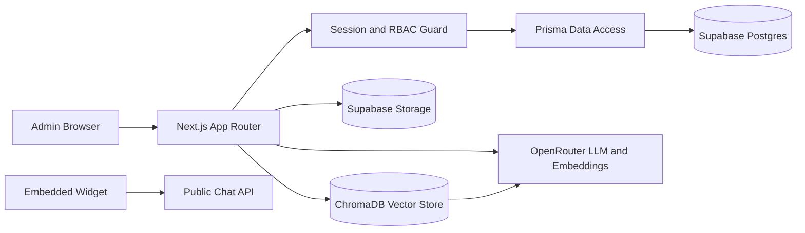

# SupportAI Agent

SupportAI Agent is a production-oriented, multi-tenant SaaS platform for AI-powered customer support. Teams can create document-grounded bots, embed support widgets, manage users with role-based access control, and monitor tenant-scoped activity and analytics.

## What This Project Delivers

- Multi-tenant SaaS architecture with strict server-side tenant isolation.
- Role-based access control for super admin, company admin, and company user roles.
- RAG chat responses grounded in uploaded documents, including citations and refusal behavior when context is missing.
- Public embeddable chatbot endpoint for active bots.
- Company-scoped bot, document, user, conversation, and analytics workflows.
- Supabase-backed PostgreSQL and storage integration with Prisma data access.
- Dockerized runtime, automated tests, and security/performance test commands.

## Screenshots

Repository screenshots:

- [Landing page preview](docs/screenshots/landing.png)
- [Super Admin Dashboard preview](docs/screenshots/super-admin.png)
- [Company Admin Dashboard preview](docs/screenshots/company-admin.png)

## Architecture Overview



For deeper architecture detail, see [docs/ARCHITECTURE.md](docs/ARCHITECTURE.md).

## Tech Stack

- Frontend and backend: Next.js App Router, React, TypeScript
- Styling: Tailwind CSS
- Data access: Prisma
- Database and object storage: Supabase
- Vector store: ChromaDB
- LLM and embeddings: OpenRouter, LangChain ecosystem
- Testing: Node test runner with unit, integration, API, E2E, security, and performance suites

## Getting Started

### Prerequisites

- Node.js 20+
- npm
- PostgreSQL-compatible database URL (Supabase recommended)
- ChromaDB (local container/CLI or cloud)

### Step-by-Step Local Setup (Production Branch)

1. Clone the repository:

```bash
git clone https://github.com/abu-bakarr/AI-Engineering-Project.git
```

2. Move into the project directory:

```bash
cd AI-Engineering-Project
```

3. Switch to the production branch:

```bash
git checkout production
```

4. Install dependencies:

```bash
npm install
```

5. Create your local environment file:

```bash
cp .env.example .env
```

6. Configure the values in `.env` (database, Supabase, Chroma, OpenRouter, and auth settings).

7. Apply database migrations:

```bash
npm run prisma:migrate:deploy
```

8. Start the app:

```bash
npm run dev
```

9. Open the app at http://localhost:3000

### Local Setup with Managed Chroma Startup (Optional)

```bash
node ./scripts/dev-with-chroma.mjs
```

This helper attempts to start Chroma locally, checks readiness, and then launches Next.js.

## Environment Variables

Minimum required for a functional environment:

- OPENROUTER_API_KEY
- CHROMA_URL (or Chroma Cloud settings)
- DATABASE_URL (or SUPABASE_DB_URL)
- SUPABASE_URL
- SUPABASE_SERVICE_ROLE_KEY
- AUTH_SESSION_SECRET

Optional but commonly used:

- SUPABASE_ANON_KEY (enables Supabase password auth path)
- SUPABASE_STORAGE_BUCKET
- OPENROUTER_MODEL
- OPENROUTER_EMBEDDING_MODEL
- OPENROUTER_DOCUMENT_MODEL
- DEMO_LOGIN_PASSWORD
- EMAIL_FROM, SMTP_HTTP_ENDPOINT, SMTP_HTTP_TOKEN

Use [.env.example](.env.example) as the source of truth for full configuration.

## Demo Accounts

Local seeded users authenticate with DEMO_LOGIN_PASSWORD (default: Password123!):

| Role | Email |
| --- | --- |
| Super Admin | super@supportai.local |
| Company Admin | admin@acme.local |
| Company User | agent@acme.local |

Login flow behavior:

- If SUPABASE_ANON_KEY is configured, login first attempts Supabase password auth.
- If Supabase auth is unavailable for that login, the app falls back to local password verification.

## Common Scripts

| Command | Purpose |
| --- | --- |
| npm run dev | Start Next.js development server |
| npm run dev:next | Start Next.js dev server on port 3000 |
| npm run chroma | Start local Chroma server |
| npm run build | Generate Prisma client and build production app |
| npm run start | Start production server |
| npm run db:check | Validate database connectivity |
| npm run db:reset:supabase | Reset Supabase schema using local reset script |
| npm run prisma:migrate | Create/apply development migrations |
| npm run prisma:migrate:deploy | Apply existing migrations |
| npm run prisma:studio | Open Prisma Studio |

## Testing and Quality

```bash
npm test
npm run test:coverage
npm run test:unit
npm run test:integration
npm run test:api
npm run test:e2e
npm run test:security
npm run test:performance
npx tsc --noEmit
npm run build
```

See [docs/TESTING.md](docs/TESTING.md) for strategy and QA checklist.

## API and Health Endpoints

- Main API docs: [docs/API.md](docs/API.md)
- Health check: GET /health
- Chat endpoints: POST /api/chat and POST /chat

Protected routes require the support_ai_session cookie set by the login endpoint.

## Facebook and WhatsApp Integrations

The platform includes tenant-aware Meta channel integration for:

- WhatsApp
- Facebook Messenger

### What Is Implemented

- Integration management API with role and permission checks.
- Company-scoped channel configuration for WhatsApp and Facebook.
- Webhook verification flow for Meta subscription handshake.
- HMAC signature validation for inbound webhook payloads.
- Inbound message ingestion into tenant conversations with idempotency.
- Plan and feature gating (Growth/Enterprise) before channel usage.

### Endpoints

- Configuration: GET and PATCH /api/integrations
- WhatsApp webhook: GET and POST /api/webhooks/whatsapp
- Facebook webhook: GET and POST /api/webhooks/facebook

### Required Environment Variables

WhatsApp:

- WHATSAPP_APP_ID
- WHATSAPP_APP_SECRET
- WHATSAPP_VERIFY_TOKEN
- WHATSAPP_ACCESS_TOKEN

Facebook Messenger:

- FACEBOOK_APP_ID
- FACEBOOK_APP_SECRET
- FACEBOOK_VERIFY_TOKEN
- FACEBOOK_PAGE_ACCESS_TOKEN

Shared:

- INTEGRATION_CREDENTIAL_ENCRYPTION_KEY

### Operational Notes

- Webhooks are validated using x-hub-signature-256 and channel app secrets.
- Inbound payloads are normalized and written to the correct tenant by external account mapping.
- Duplicate events are safely ignored using channel and external message identifiers.
- Outbound Meta message delivery is currently limited; the strongest support today is inbound capture and conversation creation.

## Deployment

The platform is designed for deployment on managed hosts such as Render, Railway, or Vercel (with supporting services).

Recommended topology:

- Next.js application service
- Supabase Postgres and storage bucket
- Chroma service (cloud or persistent container)
- Managed secrets via environment variables

Deployment-specific notes are documented in [deployed.md](deployed.md).

## Repository Documentation

- API contract: [docs/API.md](docs/API.md)
- Architecture detail: [docs/ARCHITECTURE.md](docs/ARCHITECTURE.md)
- Enterprise SaaS notes: [docs/ENTERPRISE_SAAS.md](docs/ENTERPRISE_SAAS.md)
- Testing strategy: [docs/TESTING.md](docs/TESTING.md)
- Design artifact: [system design.docx](system%20design.docx)

## Contributing

Contribution guidelines are available in [CONTRIBUTING.md](CONTRIBUTING.md).
