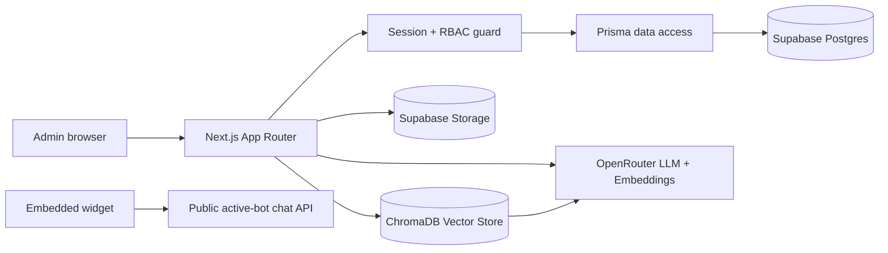
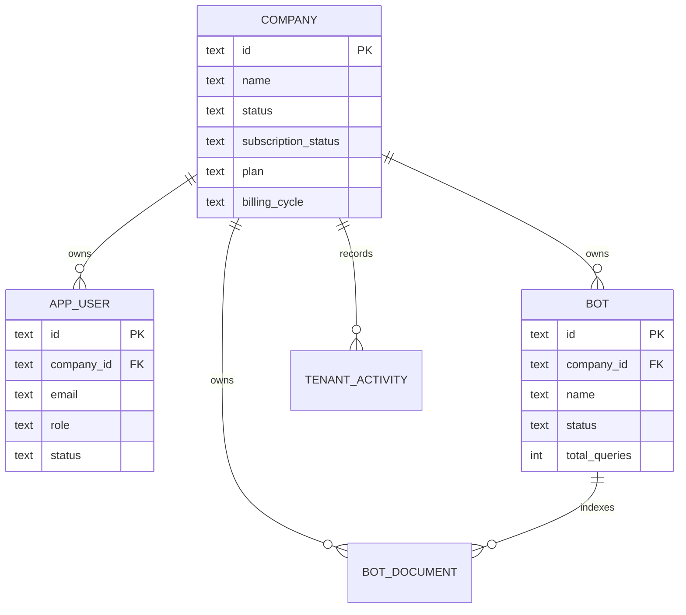

# SupportAI Agent

Production-oriented multi-tenant SaaS platform for AI-powered customer support agents. Companies subscribe to the service, manage company users, create document-grounded support bots, embed those bots on websites, and view tenant-scoped analytics.

## Capstone Highlights

- AI RAG support agents with citations and document-grounded refusal behavior.
- Multi-tenant Company architecture with server-side tenant isolation.
- Super admin, company admin, and company user RBAC.
- Company-scoped bot visibility, uploads, chat, and analytics.
- Professional one-page SaaS landing page, login, dashboards, user management, and company provisioning.
- Supabase-backed PostgreSQL schema and private document storage.
- Docker, CI, automated tests, coverage command, and security audit workflow.
- Detailed design document: [system design.docx](system%20design.docx).

## Screenshots

Repository screenshots:

- [Landing page preview](docs/screenshots/landing.svg)
- [Super Admin Dashboard preview](docs/screenshots/dashboard.svg)
- [Company Admin Dashboard preview](docs/screenshots/dashboard.svg)

Recommended live captures after deployment:

- Landing page: `/`
- Login page: `/login`
- Super admin dashboard: `/dashboard` as `super@supportai.local`
- Company dashboard: `/dashboard` as `admin@acme.local`
- User management: `/users`
- Bot management and document upload: `/bots`

## Architecture



## Multi-Tenant Data Model



## Demo Accounts

Seeded database users authenticate locally with `DEMO_LOGIN_PASSWORD`:

| Role | Email | Password |
| --- | --- | --- |
| Super Admin | `super@supportai.local` | `Password123!` |
| Company Admin | `admin@acme.local` | `Password123!` |
| Company User | `agent@acme.local` | `Password123!` |

When `SUPABASE_ANON_KEY` is configured, `/api/auth/login` attempts Supabase password auth first, then falls back to the seeded demo password for local grading.

## Installation

```bash
npm install
cp .env.example .env
npm run prisma:migrate:deploy
npm run dev
```

Open [http://localhost:3001](http://localhost:3001).

## Environment Configuration

Required:

- `DATABASE_URL` or `SUPABASE_DB_URL`
- `SUPABASE_URL`
- `SUPABASE_SERVICE_ROLE_KEY`
- `AUTH_SESSION_SECRET`
- `OPENROUTER_API_KEY`
- `CHROMA_URL`

See [.env.example](.env.example) for all keys.

## Docker

```bash
docker-compose up --build
```

The app runs on port `3001`; ChromaDB runs on port `8000`.

## API Documentation

See [docs/API.md](docs/API.md).

## Testing

```bash
npm test
npm run test:coverage
npm run test:security
npm run test:performance
npx tsc --noEmit
npm run build
```

See [docs/TESTING.md](docs/TESTING.md).

## Deployment

Recommended deployment:

- Next.js app: Railway, Render, Vercel, or containerized Kubernetes.
- Database and private object storage: Supabase.
- Vector database: Chroma Cloud or persistent Chroma container.
- Secrets: managed environment variables, not repository files.

See [deployed.md](deployed.md) and [docs/ARCHITECTURE.md](docs/ARCHITECTURE.md).

## Contributing

See [CONTRIBUTING.md](CONTRIBUTING.md).
