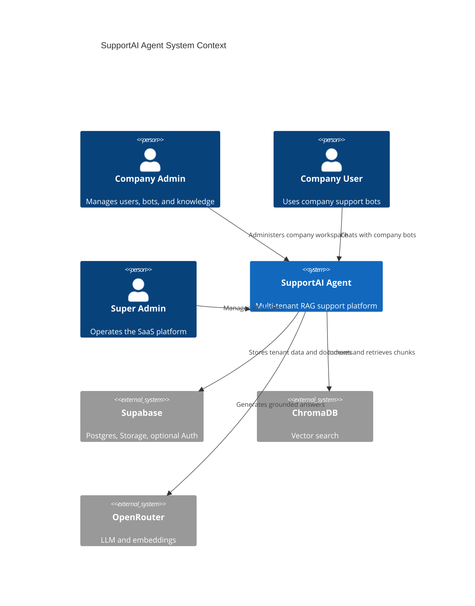
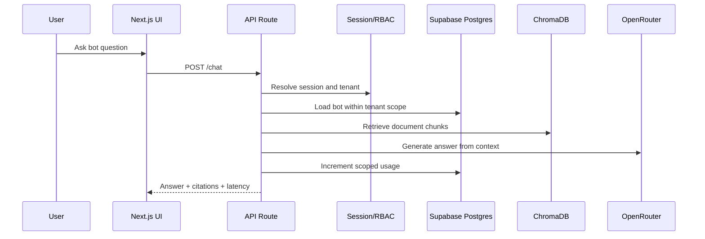
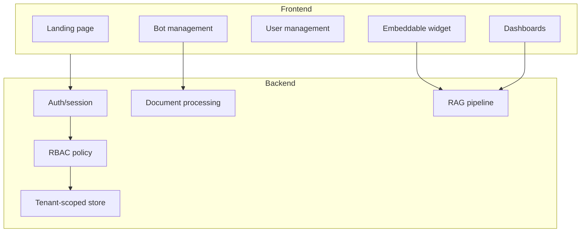

# Architecture

## System Context

## Request Flow

## Component Diagram

## Security Architecture

- Tenant-owned rows carry `company_id`.
- API routes call centralized `requirePermission`.
- Store methods apply `tenantWhere(scope)` to bot, document, user, and analytics queries.
- Super admin bypass is explicit in RBAC.
- Company users cannot provide a foreign `companyId` to create resources.
- Session cookies are httpOnly, same-site, signed, and secure in production.
- Prisma is the selected data-access strategy. Supabase is used as hosted Postgres, Storage, and optional password verification infrastructure, not as a competing ORM.
- Conversations, contacts, messages, integrations, settings, subscriptions, usage, SLA, quality, approval, and security records are modeled as tenant-owned tables.

See `docs/ENTERPRISE_SAAS.md` for the role matrix, feature matrix, webhook setup, migrations, and limitations.

## Cloud Architecture

Recommended production topology:

- CDN/WAF in front of Next.js.
- Next.js container on Railway, Render, Vercel, or Kubernetes.
- Supabase Postgres with automated backups and private Storage bucket.
- Chroma Cloud or persistent Chroma service for vectors.
- OpenRouter for model access.
- GitHub Actions for CI, tests, security audit, and build verification.

## Scalability

- Company and document indexes support tenant-filtered queries.
- Vector collections are bot-scoped.
- Upload processing can be moved to background jobs without changing the data model.
- Subscription fields allow usage limits and billing integration later.
